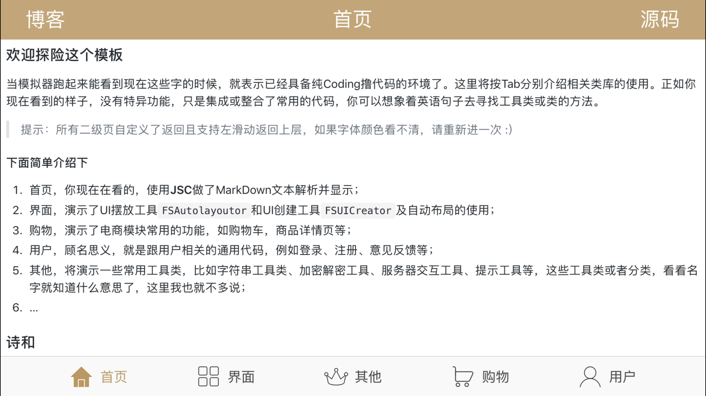

## FastApp

>  The scaffold code for iOS develop (iOS开发脚手架)
> > 为保证极速上手并投入生产，避免【Create a new Xcode project】和配置浪费时间，此脚手架只需直接下载，更改项目文件名、APP名称、资源文件后即可运行使用。




### 使用

> 使用前请注意分支版本，当前为`Objective-C`版，默认使用`CocoaPods`作为依赖管理器；如果需要使用`Swift`，请切换`Swift`分支

#### 1. 下载源码 

```
git clone https://github.com/tangkunyin/FastApp.git
```


#### 2. 改名

更改组织名称、类前缀等一切你认为有必要改的东西

#### 3. 安装依赖

```
# --no-repo-update参数可禁止索引更新，通常会缩小等待时间
pod install --no-repo-update
	
open FastApp.xcworkspace
```

### 结构

为了最大限度降低开发者选框架纠结的可能性，本项目已集成业内相对优秀的常用库，如

1. Masonry：自动布局
2. AFNetworking：网络请求
3. MJRefresh：上、下拉刷新
4. MJExtension：数据模型转换
5. MBProgressHUD：提示、进度条
6. SDWebImage：远程图片、缓存

部分工具对这些框架进行了进一步封装。使其使用更便捷。当然，我也尽可能加入必要的宏或字符串工具类、加密工具类、打分控件、轮播图实现等。

其中，`FSUICreator`封装了常用的UI创建方法，`FSPositionTools`和`FSAutolayoutor`则实现了更简单易用的UI布局的方法，你只需两行代 码即可搞定UI创建、自动布局。

### 其他

关于自动打`ipa`包的脚本，已封装在[这里](https://github.com/tangkunyin/UsefullShells)，需要的自提，不包邮！

**代码仅做学习和技术交流，由于iOS技术更新较快，如果某些语法过时或遇到其他错误，欢迎`issues`和`pull requests`**


